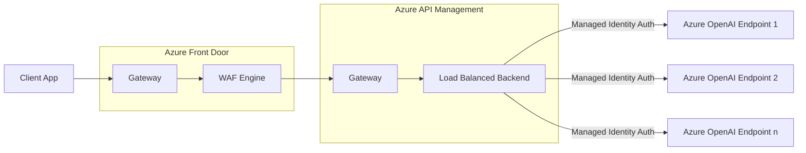

# WAF-secured Public API Management + OpenAI via Terraform

## Prerequisites
- Install [Terraform](https://developer.hashicorp.com/terraform/install) locally
- Install [Azure CLI](https://learn.microsoft.com/en-us/cli/azure/install-azure-cli-windows?tabs=azure-cli) locally
- Clone this repository locally and open the folder/workspace in your IDE
- (Optional) Install a [Terraform extension](https://marketplace.visualstudio.com/items?itemName=HashiCorp.terraform) for your IDE for syntax highlighting, etc

## Solution Structure

## Deployment Steps

1. Create a terraform.tfvars file in the repo directory and set your variables.  You can leverage the [example](/assets/example.tfvars.txt) as a starting point.
2. Run `az login` to ensure your Azure CLI is logged into your Azure account
3. Run `terraform init` in your IDE's terminal to initialize the repo.
4. Run `terraform plan --out plan.out`
5. Run `terraform apply plan.out` to deploy the solution resources.

_Note:_ You may need to run `terraform init -upgrade` depending on which version of the solution was initially deployed.  This command ensures appropriate resource providers are installed.

Some changes to the solution are breaking and will cause the solution to destroy existing instances and recreate them.  Be sure to backup any existing work in your environment before running new versions of these Terraform scripts.

## Future Enhancements
- Implement private networking for backend using private endpoints for OpenAI
- Optionally deploy [Standard v2 SKU](https://learn.microsoft.com/en-us/azure/api-management/v2-service-tiers-overview)